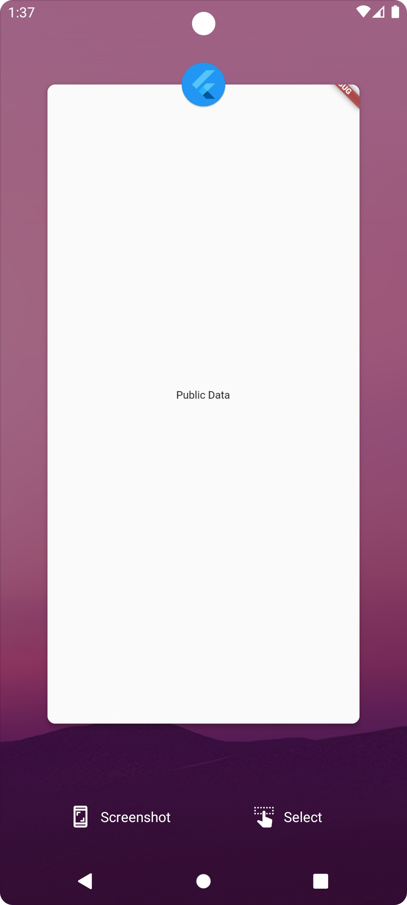
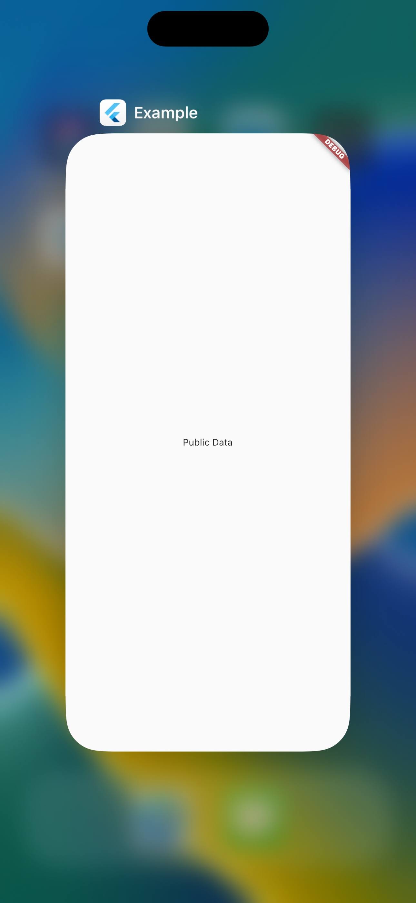

# flutter_sensitive_content 🕵️

[](https://pub.dev/packages/flutter_sensitive_content)
[](https://github.com/CarloDotLog/flutter_sensitive_content)


A Flutter package for hiding the sensitive content of your app when you switch from one app to another.

This way, no sensitive information is shown when the app previews.

## Features
Protect you sensitive content with `SensitiveContent` widget. It listen for AppLifecycle states,
when the app goes in background switch from `child` content to `publicContent` content.

## Getting started
Add this package to your yaml file 
```yaml
flutter_sensitive_content: 0.0.1
```
or exec this command:
```bash
flutter pub add flutter_sensitive_content
```

## Usage
Import the package in your dart file:
```dart
import 'package:flutter_sensitive_content/flutter_sensitive_content.dart';
```
Then, wrap your sensitive data with `SensitiveContent` widget
```dart
Scaffold(
  body: SensitiveContent(
    publicContent: Center(
      child: Text("Public Data"),
    ),
    child: Center(
      child: Text("Sensitive Data"),
    ),
  ),
);
```

| Platform | Sensitive Data                                                              | Public Data                                                           |
|----------|-----------------------------------------------------------------------------|-----------------------------------------------------------------------|
| Android  |  |  |
| iOS      |          |         |

